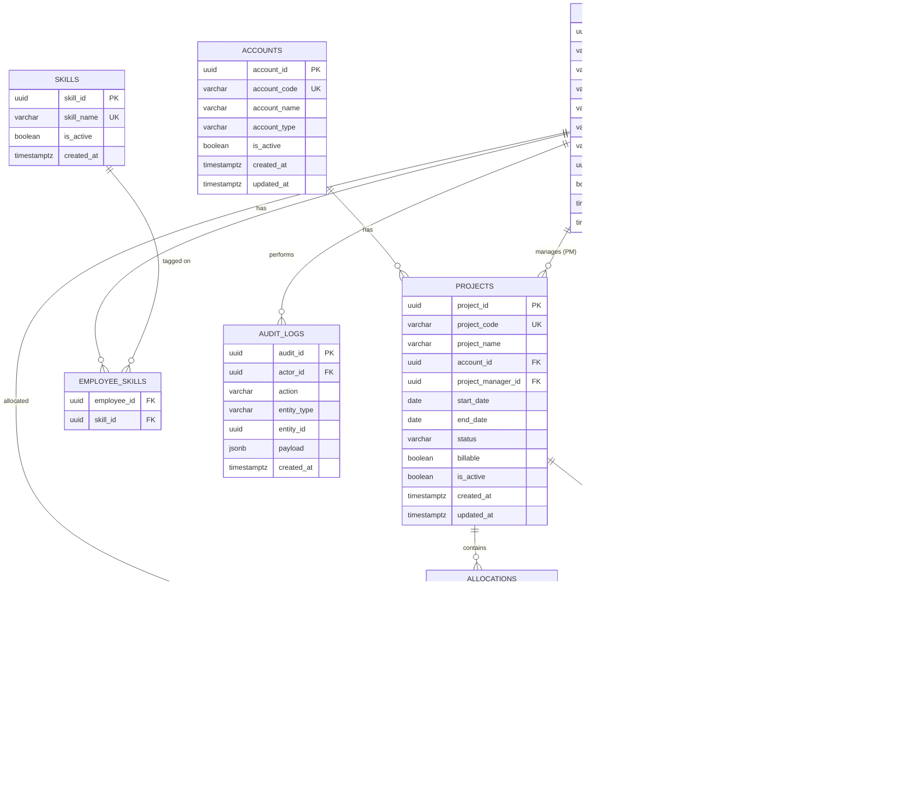

# PAMS – Entity Relationship Diagram

---

## 1. Document Control

| Field   | Value                                       |
| ------- | ------------------------------------------- |
| Project | Project Allocation Management System (PAMS) |
| Version | 1.4.0                                       |
| Date    | 2026-02-26                                  |
| Author  | ProductArchitect (GitHub Copilot)           |

---

## 2. ER Diagram

---

## 3. Relationship Notes

| Relationship                           | Cardinality  | Notes                                                             |
| -------------------------------------- | ------------ | ----------------------------------------------------------------- |
| Account → Projects                     | 1:N          | One account can have multiple projects                            |
| Employee → Employee (reports_to)       | Self-ref 0:N | Nullable; circular chains are blocked                             |
| Employee → Projects (PM)               | 1:N optional | One PM can manage multiple projects; a project has at most one PM |
| Employee ↔ Skill (via employee_skills) | M:N          | Join table; no extra attributes                                   |
| Employee → Allocations                 | 1:N          | One employee can have multiple allocations                        |
| Project → Allocations                  | 1:N          | One project can have multiple allocations                         |
| Employee → Allocations (allocated_by)  | 1:N          | Tracks who created the allocation (HR or PM)                      |
| Employee → AuditLogs (actor)           | 1:N          | All mutation events are logged against the acting employee        |
| Project → ProjectTeamMembers           | 1:N          | One project can have multiple team lead/reportee mappings         |
| Employee → ProjectTeamMembers (lead)   | 1:N          | One employee can be Team Lead on multiple projects                |
| Employee → ProjectTeamMembers (member) | 1:N          | One employee can be a reportee under different leads per project  |

---

## 4. Key Index Map

| Table                | Index Name                   | Columns                                   | Condition              | Purpose                           |
| -------------------- | ---------------------------- | ----------------------------------------- | ---------------------- | --------------------------------- |
| accounts             | idx_accounts_code            | LOWER(account_code)                       | —                      | Case-insensitive uniqueness check |
| projects             | idx_projects_account         | account_id                                | —                      | Account → project lookup          |
| projects             | idx_projects_code            | LOWER(project_code)                       | —                      | Case-insensitive uniqueness       |
| employees            | idx_employees_empcode        | LOWER(emp_code)                           | —                      | EmpCode search                    |
| employees            | idx_employees_reportsto      | reports_to                                | reports_to IS NOT NULL | Manager → reportees query         |
| employees            | idx_employees_fullname       | LOWER(first_name \|\| ' ' \|\| last_name) | —                      | Name search                       |
| employee_skills      | (PK composite)               | employee_id, skill_id                     | —                      | Join efficiency                   |
| allocations          | idx_alloc_employee_dates     | employee_id, from_date, to_date           | deleted_at IS NULL     | Capacity engine query             |
| allocations          | idx_alloc_project            | project_id                                | deleted_at IS NULL     | Project view query                |
| allocations          | idx_alloc_employee_active    | employee_id                               | deleted_at IS NULL     | Employee view query               |
| audit_logs           | idx_auditlog_entity          | entity_type, entity_id                    | —                      | Entity history lookup             |
| audit_logs           | idx_auditlog_actor           | actor_id                                  | —                      | Actor activity lookup             |
| audit_logs           | idx_auditlog_created         | created_at DESC                           | —                      | Chronological log query           |
| project_team_members | uq_ptm_project_lead_reportee | project_id, team_lead_id, reportee_id     | —                      | Unique team mapping per project   |
| project_team_members | idx_ptm_project              | project_id                                | —                      | Team config by project            |
| project_team_members | idx_ptm_team_lead            | team_lead_id                              | —                      | Projects led by employee          |
| project_team_members | idx_ptm_reportee             | reportee_id                               | —                      | Team memberships for employee     |
